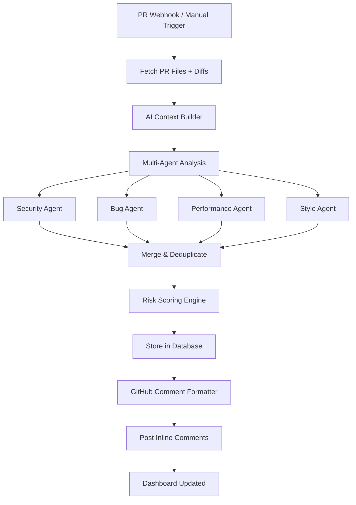

# Kodeye AI Review Engine — Walkthrough

## Overview

Built the complete AI Review Engine for Kodeye AI — the core intelligence layer that analyzes pull request diffs, detects code issues using a multi-agent AI system, generates structured review comments, calculates intelligent risk scores, and posts inline comments back to GitHub.

---

## Architecture



---

## Backend Changes

### New: AI Engine Core (14 files)

| File | Purpose |
|------|---------|
| [context.builder.ts](file:///run/media/karan/New%20Volume/Projects/Kodeye/backend/src/ai/context/context.builder.ts) | Prepares PR diffs into AI-ready context with binary filtering and token optimization |
| [review.prompt.ts](file:///run/media/karan/New%20Volume/Projects/Kodeye/backend/src/ai/prompts/review.prompt.ts) | Master review prompt — senior staff engineer persona |
| [security.prompt.ts](file:///run/media/karan/New%20Volume/Projects/Kodeye/backend/src/ai/prompts/security.prompt.ts) | Security-focused prompt (SQLi, XSS, hardcoded secrets, etc.) |
| [performance.prompt.ts](file:///run/media/karan/New%20Volume/Projects/Kodeye/backend/src/ai/prompts/performance.prompt.ts) | Performance-focused prompt (N+1, memory leaks, etc.) |
| [style.prompt.ts](file:///run/media/karan/New%20Volume/Projects/Kodeye/backend/src/ai/prompts/style.prompt.ts) | Code quality prompt (dead code, deep nesting, etc.) |
| [response.parser.ts](file:///run/media/karan/New%20Volume/Projects/Kodeye/backend/src/ai/parser/response.parser.ts) | Multi-strategy JSON parser with bracket balancing fallback |
| [schema.validator.ts](file:///run/media/karan/New%20Volume/Projects/Kodeye/backend/src/ai/parser/schema.validator.ts) | Zod validation with confidence filtering and deduplication |
| [security.agent.ts](file:///run/media/karan/New%20Volume/Projects/Kodeye/backend/src/ai/agents/security.agent.ts) | Security vulnerability detection agent |
| [bug.agent.ts](file:///run/media/karan/New%20Volume/Projects/Kodeye/backend/src/ai/agents/bug.agent.ts) | Logic error and bug detection agent |
| [performance.agent.ts](file:///run/media/karan/New%20Volume/Projects/Kodeye/backend/src/ai/agents/performance.agent.ts) | Performance bottleneck detection agent |
| [style.agent.ts](file:///run/media/karan/New%20Volume/Projects/Kodeye/backend/src/ai/agents/style.agent.ts) | Code smell and maintainability agent |
| [risk.engine.ts](file:///run/media/karan/New%20Volume/Projects/Kodeye/backend/src/ai/risk/risk.engine.ts) | Intelligent risk scoring with file sensitivity modifiers |
| [github.formatter.ts](file:///run/media/karan/New%20Volume/Projects/Kodeye/backend/src/ai/formatter/github.formatter.ts) | Formats issues into polished GitHub markdown with emojis |
| [ai.service.ts](file:///run/media/karan/New%20Volume/Projects/Kodeye/backend/src/ai/ai.service.ts) | Main orchestrator coordinating the full review pipeline |

### New: Database Migration

- [003_create_ai_tables.sql](file:///run/media/karan/New%20Volume/Projects/Kodeye/backend/supabase/migrations/003_create_ai_tables.sql) — `ai_reviews` and `risk_scores` tables

### New: Services & Controller

| File | Purpose |
|------|---------|
| [aiReviews.service.ts](file:///run/media/karan/New%20Volume/Projects/Kodeye/backend/src/services/aiReviews.service.ts) | CRUD for `ai_reviews` table with counting and stats |
| [riskScores.service.ts](file:///run/media/karan/New%20Volume/Projects/Kodeye/backend/src/services/riskScores.service.ts) | CRUD for `risk_scores` table |
| [aiReview.controller.ts](file:///run/media/karan/New%20Volume/Projects/Kodeye/backend/src/controllers/aiReview.controller.ts) | API endpoints for triggering and fetching reviews |

### Modified Backend Files

| File | Change |
|------|--------|
| [env.ts](file:///run/media/karan/New%20Volume/Projects/Kodeye/backend/src/config/env.ts) | Added `getGeminiApiKey()` and `getOpenAIApiKey()` |
| [server.ts](file:///run/media/karan/New%20Volume/Projects/Kodeye/backend/src/server.ts) | Added `express.urlencoded()` middleware |
| [api.ts](file:///run/media/karan/New%20Volume/Projects/Kodeye/backend/src/routes/api.ts) | Added AI review routes (POST/GET) |
| [githubEvents.service.ts](file:///run/media/karan/New%20Volume/Projects/Kodeye/backend/src/services/githubEvents.service.ts) | Removed test comment, clean PR sync only |
| [pullRequests.controller.ts](file:///run/media/karan/New%20Volume/Projects/Kodeye/backend/src/controllers/pullRequests.controller.ts) | Uses real AI review data instead of placeholders |
| [metrics.service.ts](file:///run/media/karan/New%20Volume/Projects/Kodeye/backend/src/services/metrics.service.ts) | Added AI review stats |
| [package.json](file:///run/media/karan/New%20Volume/Projects/Kodeye/backend/package.json) | Added `@google/generative-ai`, `zod` |

### New API Endpoints

| Method | Path | Description |
|--------|------|-------------|
| `POST` | `/api/pull-requests/:id/review` | Trigger AI review for a PR |
| `GET` | `/api/pull-requests/:id/reviews` | Get AI review findings |
| `GET` | `/api/pull-requests/:id/risk-score` | Get risk score |

---

## Frontend Changes

### New: Review Components (6 files)

| Component | Description |
|-----------|-------------|
| [RiskScoreRing.tsx](file:///run/media/karan/New%20Volume/Projects/Kodeye/frontend/src/components/review/RiskScoreRing.tsx) | Animated SVG circular progress ring with color-coded risk |
| [FindingCard.tsx](file:///run/media/karan/New%20Volume/Projects/Kodeye/frontend/src/components/review/FindingCard.tsx) | Issue card with severity badge, code location, why, and fix |
| [DiffViewer.tsx](file:///run/media/karan/New%20Volume/Projects/Kodeye/frontend/src/components/review/DiffViewer.tsx) | GitHub-like diff viewer with inline AI comment overlays |
| [ReviewTimeline.tsx](file:///run/media/karan/New%20Volume/Projects/Kodeye/frontend/src/components/review/ReviewTimeline.tsx) | Live activity feed with pulse indicators |
| [SeverityBadge.tsx](file:///run/media/karan/New%20Volume/Projects/Kodeye/frontend/src/components/review/SeverityBadge.tsx) | Color-coded severity indicator (Critical/Warning/Suggestion/Info) |
| [ReviewProcessing.tsx](file:///run/media/karan/New%20Volume/Projects/Kodeye/frontend/src/components/review/ReviewProcessing.tsx) | Animated AI processing overlay with step progression |

### Modified Frontend Files

| File | Change |
|------|--------|
| [kodeye.css](file:///run/media/karan/New%20Volume/Projects/Kodeye/frontend/src/styles/kodeye.css) | Added severity badges, finding cards, diff viewer, risk bars, filter buttons |
| [globals.css](file:///run/media/karan/New%20Volume/Projects/Kodeye/frontend/src/app/globals.css) | Added `--kd-info` and `--kd-suggestion` tokens |
| [dashboard/page.tsx](file:///run/media/karan/New%20Volume/Projects/Kodeye/frontend/src/app/dashboard/page.tsx) | Real AI metrics, critical alerts, status dots on feed |
| [pull-requests/page.tsx](file:///run/media/karan/New%20Volume/Projects/Kodeye/frontend/src/app/pull-requests/page.tsx) | Risk badges, "Start Review" button, AI status indicators |
| [pull-requests/[id]/page.tsx](file:///run/media/karan/New%20Volume/Projects/Kodeye/frontend/src/app/pull-requests/%5Bid%5D/page.tsx) | **Major overhaul** — risk ring, finding cards, diff viewer, timeline |
| [package.json](file:///run/media/karan/New%20Volume/Projects/Kodeye/frontend/package.json) | Added `recharts`, `react-syntax-highlighter` |

---

## Setup Steps Required

> [!IMPORTANT]
> **Before the system will work, you need to:**

1. **Install dependencies:**
   ```bash
   cd backend && npm install
   cd ../frontend && npm install
   ```

2. **Add Gemini API key to `backend/.env`:**
   ```
   GEMINI_API_KEY=your_key_here
   ```

3. **Run the database migration** — Execute [003_create_ai_tables.sql](file:///run/media/karan/New%20Volume/Projects/Kodeye/backend/supabase/migrations/003_create_ai_tables.sql) in your Supabase SQL editor.

4. **Start both servers:**
   ```bash
   cd backend && npm run dev
   cd frontend && npm run dev
   ```

---

## How It Works

1. **Navigate to Pull Requests** → See list with risk scores and review status
2. **Click "Start Review"** → Triggers multi-agent AI analysis
3. **Processing overlay** → Shows animated step-by-step progress
4. **View PR detail** → Risk score ring, filterable finding cards, diff viewer with inline comments
5. **GitHub** → Inline comments auto-posted on the PR with formatted markdown
