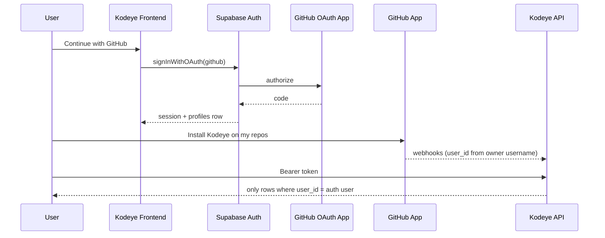

# Auth + multi-tenant setup (anyone can log in, nobody sees others’ data)

Kodeye uses **two separate GitHub integrations**. Do not mix their credentials.

| Integration | Purpose | Who can use it |
|-------------|---------|------------------|
| **GitHub OAuth App** | Sign in via Supabase (`/login` → Continue with GitHub) | Any GitHub user |
| **GitHub App** | Install on repos, webhooks, PR sync, AI comments | Any user who installs (app must be **Public**) |

**Data isolation** is enforced in the backend (every API query filters by `user_id`) and in Postgres (RLS + migration `006_multi_tenant_security.sql`). Logging in does not grant access to another user’s repositories or reviews.

---

## Part 1 — GitHub OAuth App (login for everyone)

### 1. Create the OAuth App

1. GitHub → **Settings** → **Developer settings** → **OAuth Apps** → **New OAuth App**
2. Fill in:
   - **Application name:** `Kodeye AI Login` (any name; keep distinct from the GitHub App)
   - **Homepage URL:** `http://localhost:3000` (or your production frontend URL)
   - **Authorization callback URL:**  
     `https://<PROJECT_REF>.supabase.co/auth/v1/callback`  
     Find `<PROJECT_REF>` in Supabase → **Project Settings** → **API** → Project URL  
     (`https://abcdefgh.supabase.co` → ref is `abcdefgh`)

3. Create the app → copy **Client ID** and generate a **Client secret**

### 2. Configure Supabase

1. Supabase → **Authentication** → **Providers** → **GitHub** → Enable
2. Paste the OAuth App **Client ID** and **Client secret** (not the GitHub App ID / private key)
3. Copy the **Callback URL** shown there and ensure it matches the OAuth App callback URL exactly
4. **Authentication** → **URL configuration**:
   - **Site URL:** `http://localhost:3000` (dev) or your production URL
   - **Redirect URLs:** add  
     `http://localhost:3000/auth/callback`  
     `https://your-domain.com/auth/callback`

### 3. Frontend env (`frontend/.env.local`)

```env
NEXT_PUBLIC_SUPABASE_URL=https://<PROJECT_REF>.supabase.co
NEXT_PUBLIC_SUPABASE_ANON_KEY=<anon-key>
NEXT_PUBLIC_API_BASE_URL=http://localhost:5000
```

After sign-in, the app upserts `profiles.username` from GitHub (`user_name` metadata). That username is how webhooks attach repos to the correct Supabase user.

---

## Part 2 — GitHub App (repos & webhooks, public install)

### 1. Make the GitHub App public

1. GitHub → **Developer settings** → **GitHub Apps** → **Kodeye AI**
2. **Public** (or allow the organizations/users you need)
3. If the app stays **Private**, only the owner and allowed collaborators see the app page — others get *“Kodeye AI is a private GitHub App”* when installing (this is **not** the login flow).

### 2. Do not use the GitHub App for Supabase login

Supabase **must** use the **OAuth App** from Part 1.  
Using the GitHub App’s client ID in Supabase sends users to `github.com/apps/...` and breaks login for other accounts.

### 3. GitHub App settings (for installs)

- **Setup URL / Callback:** your backend webhook URL if required by GitHub
- **Webhook URL:** `https://your-api.com/github/webhook` (or local tunnel in dev)
- Permissions: contents, pull requests, metadata, etc. (as you already configured)

### 4. Env

**Frontend** (`frontend/.env.local`):

```env
NEXT_PUBLIC_GITHUB_APP_SLUG=kodeye-ai
```

(slug from `https://github.com/apps/<slug>`)

**Backend** (`backend/.env`):

```env
GITHUB_APP_ID=
GITHUB_PRIVATE_KEY=
GITHUB_WEBHOOK_SECRET=
SUPABASE_URL=
SUPABASE_ANON_KEY=
SUPABASE_SERVICE_ROLE_KEY=
FRONTEND_URL=http://localhost:3000
```

---

## Part 3 — Database (tenant isolation)

Run in Supabase SQL Editor (if not already applied):

1. `backend/supabase/migrations/006_multi_tenant_security.sql`
2. If `finding_interactions` failed earlier: `006b_finding_interactions_user_id_fix.sql`

Verify:

```sql
SELECT id, username FROM public.profiles;
SELECT repo_name, owner, user_id FROM public.repositories WHERE user_id IS NULL;
```

Orphan repos with `user_id IS NULL` are invisible to all users until backfilled or deleted.

---

## User flow (correct order)



1. **Log in** — `/login` → **Continue with GitHub** (OAuth only)
2. **Install app** — Overview / Repositories → **Install GitHub App** (once per account)
3. Use the product — API returns only that user’s data

---

## Troubleshooting

| Symptom | Fix |
|--------|-----|
| “Kodeye AI is a private GitHub App” on login | Supabase GitHub provider uses wrong credentials; switch to **OAuth App** Client ID/secret |
| Same message when clicking Install | Set GitHub App to **Public**, or add user as app collaborator |
| User A sees User B’s repos | Run migration 006; confirm API sends `Authorization: Bearer`; check `repositories.user_id` |
| Webhooks create repos but login user sees nothing | `profiles.username` must match repo `owner`; user must log in once before/with install |

---

## Security summary

- **Login:** OAuth App → Supabase JWT → `requireAuth` on all `/api/*` routes
- **Data:** `user_id` on all tenant tables + service-layer `.eq('user_id', userId)` + RLS as backup
- **Webhooks:** service role writes; `resolveWebhookUserId(owner)` maps repo → Supabase user

Anyone with a GitHub account can sign in; they only ever read and write **their own** tenant rows.
